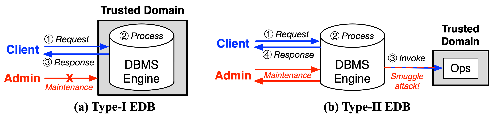
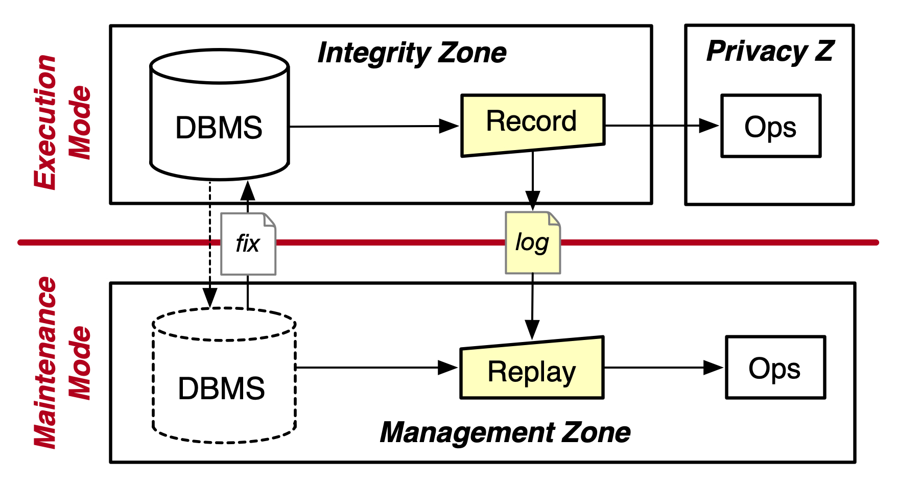

<p align="center">
	
</p>

[](http://license.coscl.org.cn/MulanPubL-2.0)

HEDB is an extension of PostgreSQL to compute SQL over ciphertexts, in addition to a suite of maintenance tools.

*HEDB is an open project and highly values your feedback! We would like to hear your thoughts on our project and how we can improve it.*

## Quick Start

Install the dependencies:
```sh
$ sudo apt update
$ sudo apt install -y build-essential cmake libmbedtls-dev
$ sudo apt install -y postgresql postgresql-contrib postgresql-server-dev-all
$ sudo service postgresql restart
```

Pull the HEDB repo, build and install:
```sh
$ git clone -b main --depth 1 https://github.com/SJTU-IPADS/HEDB
$ cd HEDB
$ make
$ sudo make install
$ make run

$ sudo -u postgres psql
```

Run your 1st SQL:
```sql
CREATE EXTENSION hedb;

DROP TABLE IF EXISTS test;
CREATE TABLE test (a int, b enc_int4);

SELECT enable_client_mode();                --- use client mode to insert user value
INSERT INTO test VALUES (1, '1'::enc_int4); --- note that encrypted data is inserted as string
INSERT INTO test VALUES (2, '2'::enc_int4); --- note that encrypted data is inserted as string
SELECT * FROM test;

SELECT enable_server_mode();                --- use server mode for database admins (DBAs) to maintain the database
SELECT * FROM test;
```

There are currently four encrypted datatypes for you to selectively protect your data stored in PostgreSQL.
| data type | encrypted data type |
|-----------|---------------------|
| int       | enc_int4            |
| float     | enc_float4          |
| text      | enc_text            |
| timestamp | enc_timestamp       |

To learn more about the usage, see [unit-test](https://github.com/SJTU-IPADS/HEDB/blob/main/tests/unit-test/unit-test.sql).

So far so good. But it is **NOT secure** at all!

Here is a quick overview for any newcomers to understand the purpose of HEDB.

## Encrypted Databases

Database systems may contain sensitive data, and some are outsourced to third-parties to manage, optimize, and diagnose, called database-as-a-service (DBaaS). To protect sensitive data in use, secrets should be kept encrypted as necessary.

<p align="center">
  
</p>

**Option-1**: To build an encrypted database (EDB), one can place an entire database into an isolated domain, or confidential computing unit (like Intel SGX, AMD SEV, Intel TDX, ARM Realm, IBM PEF, AWS Nitro, Ant HyperEnclave, and whatever you name it). We call it Type-I EDB. Sadly, Type-I would prevent database admins, or DBAs, from managing the database, right? If DBAs were able to log into the DBMS, they would inspect any user data.

**Option-2**: Cloud DBaaS vendors such as Azure, Alibaba, Huawei and others provision operator-based EDBs. You can dive into [here](https://github.com/SJTU-IPADS/HEDB/blob/main/src/) to navigate how to build such an EDB using PostgreSQL' user-defined types (UDTs) and user-defined functions (UDFs). We call it Type-II EDB. Type-II EDB allows a DBA to log into the database, but keeps data always in ciphertext to avoid potential leakage. Cool!

Sad again, we've discovered an attack named "Smuggle". You can find how it works in [tools/smuggle.py](https://github.com/SJTU-IPADS/HEDB/blob/main/tools/smuggle.py), which reveals an integer column in TPC-H. The reason why smuggle exists is that the Type-II EDB exposes sufficient expression operators for admins to construct an "oracle".

## Smuggle Attacks

Here is a minimal working example.

1. **Constructing oracles**:
   i. With ÷, DBAs obtain the ciphertext of '1' by dividing a number by itself.
   ii. With '1', DBAs construct all encrypted integers by iteratively + the cipher '1' to a counter.

2. **Recovering secrets**: With =, DBAs recover encrypted values by comparing them with known ciphertexts.

## HEDB as a Solution

<p align="center">
  
</p>

The idea of HEDB is simple. It splits the running mode of an EDB into two: *Execution Mode* for users, and *Maintenance Mode* for DBAs. HEDB is named after Helium, implying its two modes. HEDB removes the tension between security and maintenance.

1) *Execution Mode* prevents Smuggle attacks by blocking non-user operator invocations,
2) *Maintenance Mode* allows DBAs to perform maintenance tasks by replaying invocations.

### Defense

To launch HEDB, you need to use two confidential VMs (CVMs) as the setting. For those who do not have CVMs machines (e.g., ARM CCA, AMD SEV, Intel TDX, etc.), you can use 2 QEMU-KVM VMs to simulate CVMs. Depending on your computer architecture, either choose [vm-setup-aarch64.md](https://github.com/SJTU-IPADS/HEDB/blob/main/docs/vm-setup-aarch64.md) or [vm-setup-x86_64.md](https://github.com/SJTU-IPADS/HEDB/blob/main/docs/vm-setup-x86_64.md). These tutorials will guide you on how to create 2 VMs that host DBMS and operators, separately, and how to perform a mode switch using QEMU-based VM snapshotting.

### Record/Replay

HEDB [record/replay](https://github.com/SJTU-IPADS/HEDB/tree/main/src/integrity_zone/record_replay) is meant for reproducing bugs. It logs all ops invocations, including parameters and results, for later replays. We use TPC-H as the demonstrative benchmark.

For privacy reasons, SQL constants should be encrypted in advance. Because the current implementation lacks client-side encryption, we should transform the constants into encrypted values using operators in the client mode. A future work is to seek and implement a simple client-side encryption or proxy-side encryption.

```sh
## make dependencies installed
$ pip3 install psycopg2 tqdm

# go to TPC-H test dir
$ cd tests/tpch

# update the password of the postgres user
$ sudo -u postgres psql
postgres=# ALTER USER postgres WITH PASSWORD 'postgres';

## generate and load data
$ python3 run.py --load

## transform TPC-H queries into secure SQLs, which generates `cipher-query`
$ python3 run.py --transform

## record TPC-H
$ python3 run.py --skip-generate --record-replay record

## replay TPC-H
$ python3 run.py --skip-generate --record-replay replay
```

If you shut down the operators VM, you can still replay the SQLs. This is exactly how HEDB prevents Smuggle but can reproduce bugs for DBAs.

### Hotfix

HEDB translates common DBA actions into hotfix templates.
HEDB runs a hotfix server inside the DBMS CVM, and allows a skillful DBA to instruct the server as a maintenance agent. Please read details in [tools/hotfix](https://github.com/SJTU-IPADS/HEDB/tree/main/tools/hotfix).

### Paper

* [Encrypted Databases Made Secure Yet Maintainable](https://www.usenix.org/conference/osdi23/presentation/li-mingyu), USENIX OSDI 2023 <br>

```bibtex
@inproceedings{li2023hedb,
  author       = {Mingyu Li and Xuyang Zhao and Le Chen and Cheng Tan and Huorong Li and Sheng Wang and Zeyu Mi and Yubin Xia and Feifei Li and Haibo Chen},
  title        = {Encrypted Databases Made Secure Yet Maintainable},
  booktitle    = {17th USENIX Symposium on Operating Systems Design and Implementation (OSDI 23)},
  pages        = {117--133},
  url          = {https://www.usenix.org/conference/osdi23/presentation/li-mingyu},
  isbn         = {978-1-939133-34-2},
  publisher    = {{USENIX} Association},
  address      = {Boston, MA},
  year         = {2023},
  month        = jul,
}
```

### FAQs

#### Q1: Is HEDB limited to ARM?

***Absolutely not!*** You can deploy it to any TEE or CC platform you like. For exmaple, confidential VM (CVM) is widely supported on modern trusted hardware, such as AMD SEV(-ES,-SNP), Intel TDX, IBM PEF, ARMv9 Realm. You can deploy HEDB's integrity zone (DBMS+extension) using one CVM, and HEDB's privacy zone (operators) in another CVM. If you trust the hypervisor, like AWS Nitro Enclave, you can run them in two Nitro VMs. That's it!

To reproduce the performance evaluation results, you can run HEDB using two CVMs on a CC machine.

#### Q2: How to realize two modes?

Our prototype assumes an ARM server that supports S-EL2, a hardware virtualization technology present in ARMv8.4. [Twinvisor](https://github.com/TwinVisor/twinvisor-prototype) is an S-EL2 hypervisor developed by IPADS@SJTU. We plan to commit the Twinvisor patch, but no guarantee (for intellectual property reasons). You may also run two VMs atop Linux/KVM to implement two modes, as described in the [vm-setup.md](https://github.com/SJTU-IPADS/HEDB/blob/main/docs/vm-setup-aarch64.md).

For other platforms such as AMD SEV, Intel TDX, IBM PEF, and ARM Realm, the task is to enable CVM fork or migration between trusted domains and untrusted domains. This task remains undone. If CVM fork/migration is needed in other scenarios, it could serve as a potential research area.

#### Q3: Supporting TPC-C?

The released version of HEDB is built on PostgreSQL. Currently, its record-and-replay only supports the TPC-H benchmark.

We encourage future research to overcome this challenges posed by non-determinism when running TPC-C atop HEDB. We believe your excellent work will also be published and known to the industry.

### Anecdote

Why name HEDB (Helium Database)?

HE, short for [Helium](https://en.wikipedia.org/wiki/Helium), is the lightest neutral gas, known for its lack of reactivity and low density. The analogy to helium highlights HEDB's ability to achieve isolation from the rest while maintaining simplicity in usage. More, the reference to helium being the 2nd element alludes to HEDB's dual modes.

HEDB is pronounced [haɪdiːbiː] or 嗨嘀哔.

### Note

This repository is a research prototype, not for production use. It is meant for experimenting, researching and educational purposes to enhance students' understanding of the EDB's internals.

## Maintainers

- Xuyang Zhao: https://github.com/zhaoxuyang13
- Le Chen: https://github.com/Casieee
- Mingyu Li: https://github.com/Maxul

## Acknowledgement

- Database and Storage Lab@Alibaba DAMO Academy, who provides insights from real-world DBA tasks.
- [StealthDB](https://github.com/cryptograph/stealthdb), who provides the initial version of EDB extensions for PostgreSQL.
